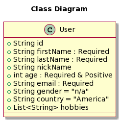

<h3 align="center">User Api</h3>

This is a REST API that allows to :
<ul>
 <li>register a user</li>
 <li>view a user's details </li>
 <li>list all users</li>
</ul>

Technical Informations:
<ul>
 <li>Docker engine running is <b>needed</b></li>
 <li><b>Mongo</b> is used as database. No need to install it.</li>
 <li>The application is containerized, built on top of mongo image.</li>
 <li><b>Swagger</b> is used for API documentation <b>http://localhost:8080/swagger-ui.html</b></li>
 <li>Maven project</li>
 <li>It's possible to run it via <b>spring-boot:run</b></li>

</ul>

[Swagger-UI](http://localhost:8080/swagger-ui.html)

<h3 align="left">Languages and Tools:</h3>

 
 
 

